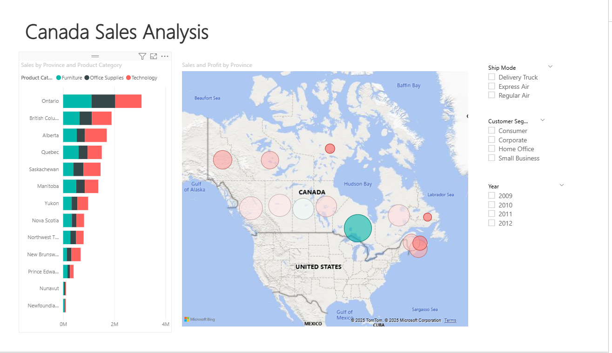
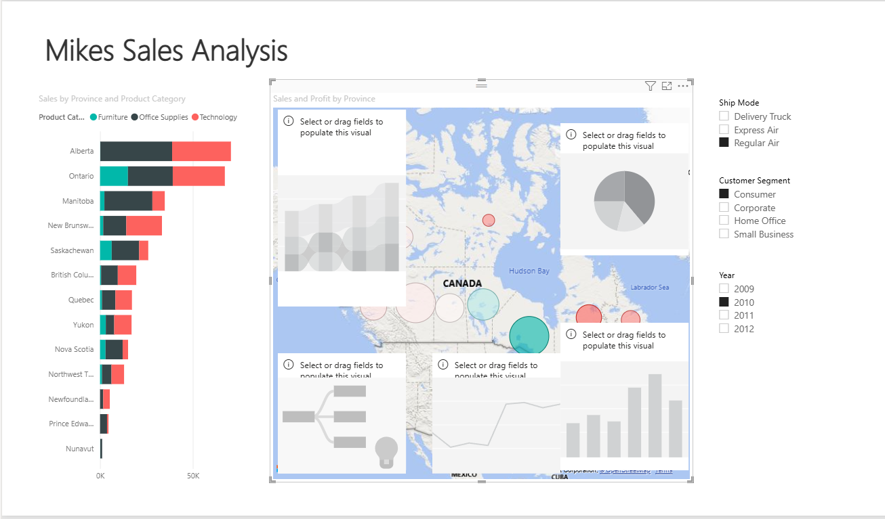

# 📊 Consumer Analysis – Power BI Report

This project contains an interactive Power BI dashboard designed to analyze consumer behavior, regional sales distribution, and product performance across the Greek market.

---

## 🖼️ Dashboard Overview

The main dashboard provides a high-level summary of the business performance, including:

- 📈 Total Sales and Monthly Trends
- 🛍️ Top-selling Products and their Contribution
- 🌍 Regional Breakdown of Sales
- 📅 Year-over-Year and Monthly comparisons

Interactive slicers allow filtering by:
- Time period
- Product category
- Region

---

## 👥 Customer Insights

This section focuses on customer behavior analytics using basic segmentation and trend tracking.

It highlights:
- 📊 Purchase Frequency and Recency
- 💸 Average Order Value
- 🎯 Key segments like new vs returning customers
- 🧠 Actionable insights for marketing targeting

---

## 📁 Files Included

- `c1_u1.pbix` – Main Power BI report  
- `erotima7.pbix` – Alternative/experimental version  
- `Power BI template pbit.pbit` – Base template for reuse  
- `/screenshots` – Preview images for this documentation  

---

## ⚙️ Technologies

- Power BI Desktop
- DAX (basic measures)
- Excel (.xlsx) as data source

---

## 📄 License

This project is licensed under the [MIT License](LICENSE).
